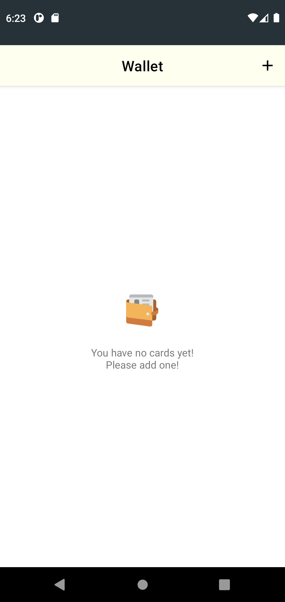
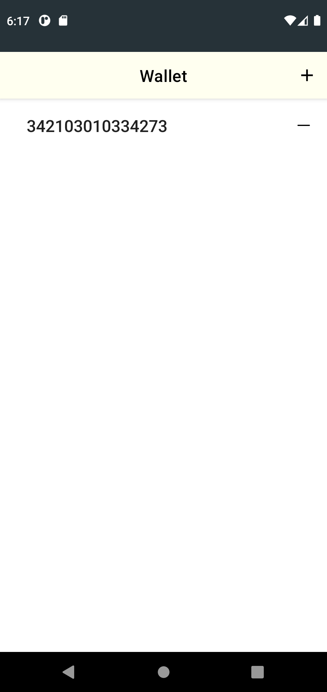
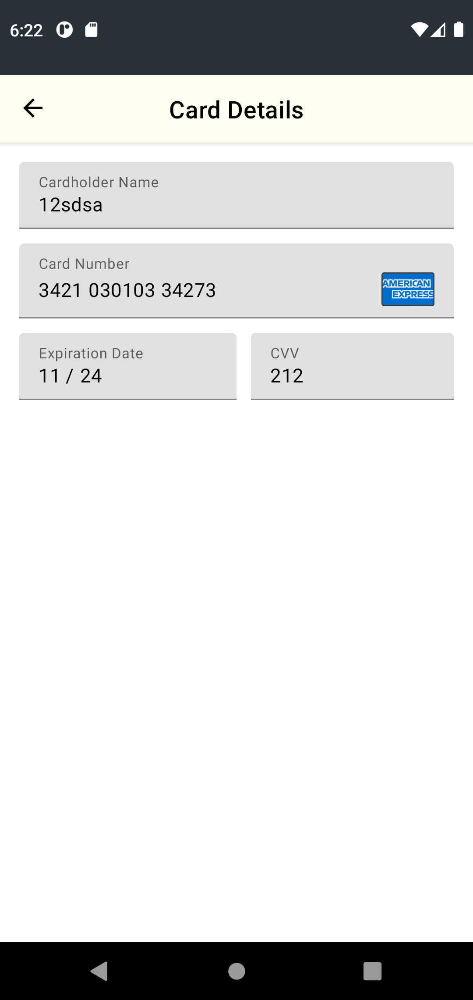
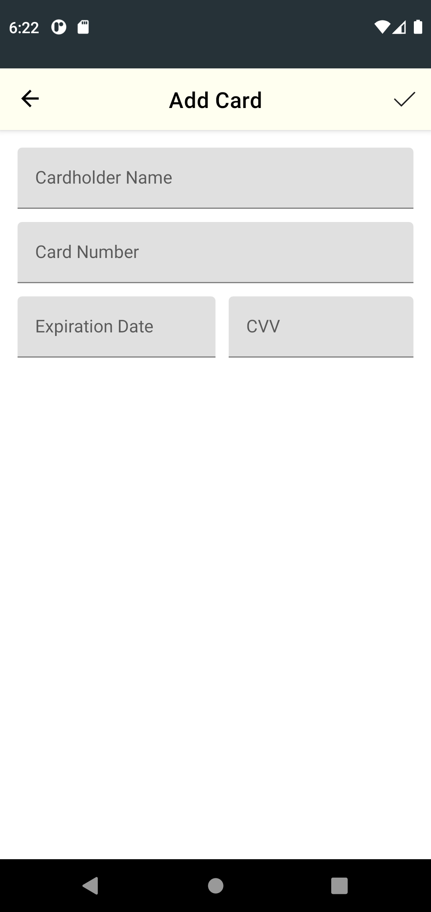
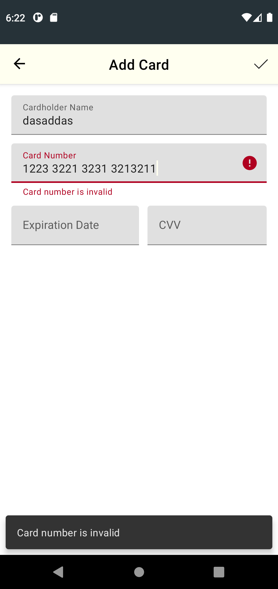

# Wallet app for Bits Interview

### Summary

This sample is written in Kotlin has 3 screens (Cards List, Add New Card, View Eisting Card) and uses the following Components:
 - ViewModel
 - LiveData
 - Data Binding
 - Navigation
 - Room
 - [Hilt](https://developer.android.com/training/dependency-injection/hilt-android) for dependency injection
 - [Card Form from Bintree](https://github.com/braintree/android-card-form) for some basic card validation

### Testing

Have both UI and Unit tests.

UI tests use Hilt to provide their test versions.

This is done by creating a `CustomTestRunner` that uses an `Application` configured with Hilt. As
per the [Hilt testing documentation](https://developer.android.com/training/dependency-injection/hilt-android),
`@HiltAndroidTest` will automatically create the right Hilt components for tests.

## Screenshots

  
  

  

  
  

